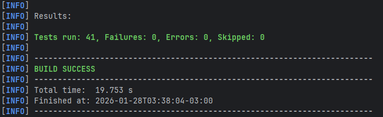
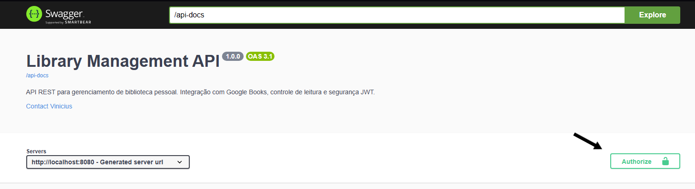

# 📚 Library Management API


> Uma API RESTful robusta para gerenciamento de biblioteca pessoal, desenvolvida com boas práticas de Engenharia de Software.

---

## 🚀 Sobre o Projeto

Este projeto é uma API Backend desenvolvida para gerenciar livros, usuários e leituras dentro de uma estante pessoal
de determinado usuário. O sistema permite o cadastro de usuários, autenticação segura via Token, gerenciamento de
estantes virtuais e busca automática de informações de livros através da integração com a API do Google Books.

O foco principal do desenvolvimento foi a aplicação de **Arquitetura em Camadas**, **Segurança**, **Testabilidade** e **DevOps** (Dockerização).

### ⭐️ Funcionalidades Principais
* **Autenticação e Segurança:** Login e Cadastro com JWT (JSON Web Token) e Spring Security.
* **Gestão de Livros:** CRUD completo de livros.
* **Integração Externa:** Consumo da Google Books API via `WebClient` para preenchimento automático de dados.
* **Controle de Leitura:** Reviews, Notas e Status de leitura.
* **Documentação Viva:** Interface Swagger UI (OpenAPI 3) para testes interativos.

---

## 🛠 Tecnologias Utilizadas

* **Linguagem:** Java 21+
* **Framework:** Spring Boot 3
* **Banco de Dados:**
    * *Dev:* H2 Database (In-Memory)
    * *Prod:* PostgreSQL (via Docker)
* **Segurança:** Spring Security, JWT (Auth0)
* **Cliente HTTP:** WebClient (Reativo)
* **Testes:** JUnit 5, Mockito, MockWebServer
* **DevOps:** Docker, Docker Compose
* **Documentação:** SpringDoc (Swagger)

---

## 🏗 Arquitetura

O projeto segue uma arquitetura clássica em camadas para garantir separação de responsabilidades:

1.  **Controller Layer:** Pontos de entrada da API (REST). Lida apenas com HTTP e DTOs.
2.  **Service Layer:** Regras de negócio, validações e orquestração.
3.  **Repository Layer:** Comunicação com o banco de dados (Spring Data JPA).
4.  **Client Layer:** Comunicação com APIs externas (Google Books).

---

## 🐳 Como Rodar (Docker - Recomendado)

A maneira mais fácil de rodar a aplicação completa (API + Banco de Dados) é usando Docker.

**Pré-requisitos:** Docker e Docker Compose instalados.

1. Clone o repositório:
   ```bash
   git clone https://github.com/ViiniVinicin/api_library.git
   cd api_library
    ```
2. Gere o pacote da aplicação:

   **Windows (PowerShell):**
   ```powershell
    .\mvnw clean package -DskipTests
    ```

    **Linux/Mac:**
    ```bash
        ./mvnw clean package -DskipTests
    ```

    **Suba os Containers:**
    ```bash
        docker-compose up --build
    ```

    **Acesse a documentação:** Abra "http://localhost:8080/swagger-ui.html" no seu navegador.

## 💻 Como Rodar (Localmente - Modo Dev)

Se quiser rodar sem Docker para desenvolvimento rápido (usando banco H2 em memória):

1. Certifique-se de ter o Java 21+ instalado.

2. Execute o comando:

    **Windows:** `.\mvnw spring-boot:run`

    **Linux/Mac:** `./mvnw spring-boot:run`

3. O perfil dev será ativado automaticamente.

4. **Console do Banco H2:** http://localhost:8080/h2-console

## 🧪 Testes
O projeto possui uma suíte de testes unitários e de integração cobrindo Services, Controllers e Clients externos.

1. Para rodar os testes:
    ```bash
        .\mvnw test
    ```
    

## 📑 Documentação da API (Swagger)
A API é totalmente documentada com OpenAPI 3.
* **Autenticação:** Clique no botão **Authorize** (cadeado verde) e insira o token JWT recebido no login.

* **Interface:** Permite testar requisições diretamente pelo navegador.
* 

## 📞 Contato

Erick Vinícius de Oliveira Nascimento

LinkedIn: linkedin.com/in/erickvini/

Email: erickvini96@gmail.com

GitHub: github.com/ViiniVinicin